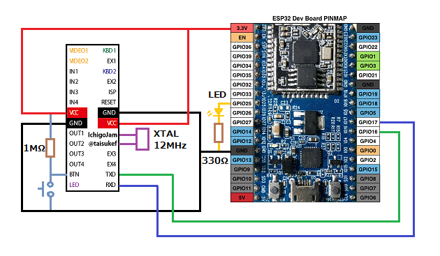

# ESP32_IchigoLatte_Telnet
ESP32でIchigoLatteをTelnetで接続できるようにします。  
### 特徴 ###
* IchigoLatteにモニタやキーボードを付けなくてもWiFi経由でIchigoLatteを操作できます。 
* MixJuiceの"MJ GET"、"MJ POST"コマンドが使えます。
* MixJuiceの"MJ GET"コマンドが使えるのでMixJuice対応のサイトから直接プログラムをダウンロードできます。 
* エスケープシーケンス対応のターミナルソフトを使えばカラー表示等ができます。 
  
### 必要な物 ###
* IchigoLatte、またはIchigoLatteファーム書き込み済みのLPC1114FN28 
* ESP32-DevKitC 
* Arduino IDE (1.8.2で動作確認をしました。) 
* [Arduino core for ESP32 WiFi chip](https://github.com/espressif/arduino-esp32 "Title")
* [QueueArray Library For Arduino](http://playground.arduino.cc/Code/QueueArray "Title") 

### 配線(LPC1114FN28を使った例) ###
  

### 使い方 ###
 1. スケッチのssidとpasswordを自分の環境に合わせて書き換えて下さい。 
 2. ESP32にスケッチを書き込み後、シリアルモニタを開くとIPアドレスとポート番号が表示されるのでメモしておいて下さい。
 3. Tera Termを使う場合の設定  
  
  
 4. Telnetで接続後IchigoLatteのBTNスイッチを押すと、IchigoLatteのシェルのプロンプトが表示されます。

### 制限事項 ###
* IchigoLatteのviエディタは使えません。 
* 画面制御コマンドには対応していません。 

---
IchigoLatte and MixJuice by na-s.jp (Natural Style Co. Ltd.) / PCN  
Michio OnoさんのMicJackのソースの一部を使わせて頂いております。 
MicJack CC BY Michio Ono (Micono Utilities) <http://ijutilities.micutil.com> 
 
